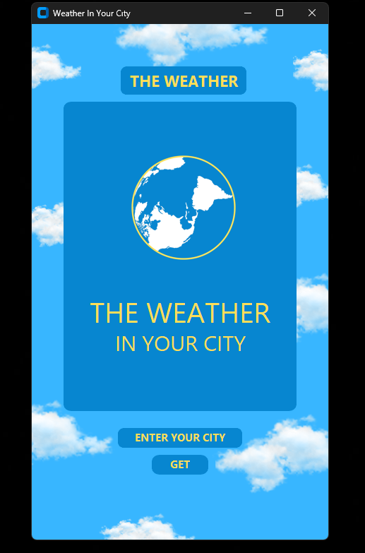
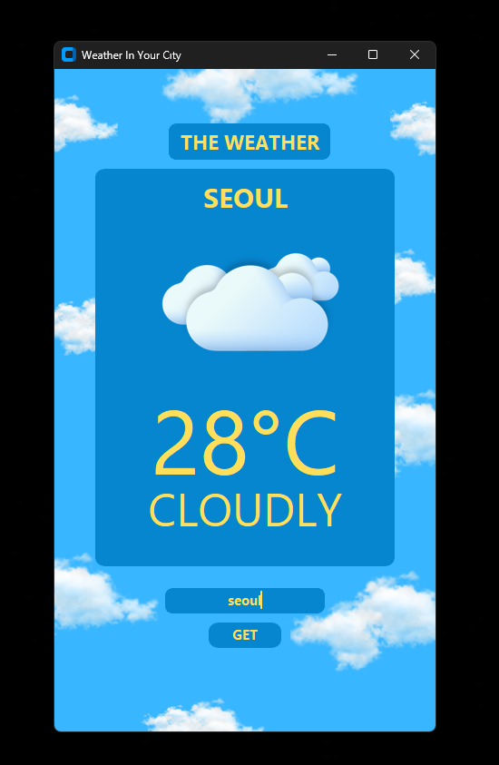

# forecaster-app
A Python-based weather application with a modern GUI built using **CustomTkinter**.   It fetches live weather data from the **OpenWeatherMap API** and displays the temperature, city name, and weather condition with relevant icons.

# 🌦 Weather In Your City

A Python-based weather application with a modern GUI built using **CustomTkinter**.  
It fetches live weather data from the **OpenWeatherMap API** and displays the temperature, city name, and weather condition with relevant icons.

---

## ✨ Features
- Enter any city name and get the **current weather**.
- Displays:
  - 🌡️ Temperature (°C)
  - 🌍 City name
  - ⛅ Weather condition (Clear, Cloudy, Rainy, Snowy, Foggy, Stormy)
- Beautiful UI with **CustomTkinter** and custom weather icons.
- Error handling (shows a warning if city not found).

## 🚀 Usage

Run the application with:
python main.py

1. Type the name of a city into the input field.
2. Click GET.
3. The app will display:
-The city name
-The current temperature in °C
-The weather condition with an icon

## 📷 Screenshots

📂 Project Structure
.
├── main.py
├── weatherBackground/
│   ├── cloudbg.png
│   ├── cl2.png
│   ├── sun.png
│   ├── FOGGY.png
│   ├── rainyNew.png
│   ├── snowfall.png
│   ├── thunder.png
│   ├── cloudlyNew.png
│   └── logo1.png

📜 License

This project is licensed under the MIT License. Feel free to modify and use it for your own purposes.

🙌 Credits

CustomTkinter

OpenWeatherMap API

Pillow (PIL)
